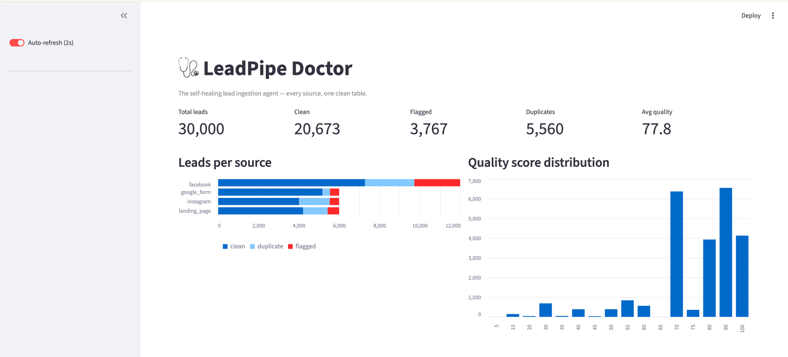
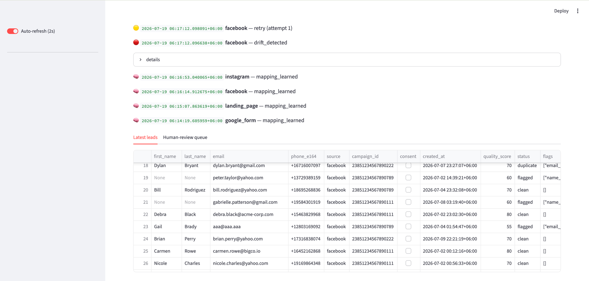

# 🩺 LeadPipe Doctor

**The self-healing lead ingestion agent.** Adapts to any lead source · cleans every lead · fixes itself when sources change.

> "Every marketing source speaks a different language. We build the translator that never breaks — and fixes itself when it does."

## The problem

US businesses pay for every lead — Facebook Lead Ads, Instagram exports, Google Forms, landing pages — then lose them in their own data plumbing. Every source ships a different shape (`full_name` in nested JSON vs `'Full Name'` in CSV vs `"What's your name?"` vs `fname`+`lname`), phones arrive in 7+ formats a dialer can't call, consent flags go missing (TCPA risk), ~25% of people arrive from more than one source, and when Meta silently renames a field, hardcoded pipelines crash or silently drop paid-for leads.

Rule-based ETL rots because humans write the rules. **LeadPipe Doctor is agent-based: it infers the mapping rules, validates its own output against a frozen canonical schema, and rewrites the rules when reality changes.** The LLM is structural, not decorative — but it never touches individual leads. It writes and repairs the *mapping* that battle-tested cleaning code executes at 100k-row scale.

## How it works

```
raw leads (any format)
   │
   ▼
PROFILE  field names + sample values + fill rates
   ▼
MAP      LLM (local Qwen 2.5 7B) returns {source_field: transform} as JSON,
         grounded by RAG over previously-approved mappings (ChromaDB)
   ▼
CLEAN    pre-built transforms: phone→E.164, email validation, dates→UTC,
         consent normalization, name split/casing/emoji-strip
   ▼
VALIDATE every row against a strict Pydantic canonical schema
   │
   ├─ OK ────────────────► DuckDB unified leads table (raw payload preserved)
   │
   └─ MAPPING DRIFT ─────► 🔴 diagnostic report fed back to the LLM
                           🟡 corrected mapping, re-process (max 3 attempts)
                           🟢 healed, zero human touch — or 🟠 human-review queue
```

Approved mappings are cached (`data/mappings.json`) — the LLM only runs for unknown sources or detected drift, so the steady-state fast path is pure Python at ~500 rows/s.

## Quickstart (3 commands)

```bash
docker compose up               # full stack: Ollama + pipeline + dashboard
# or locally (needs ollama installed + `ollama serve` running):
pip install -r requirements.txt && python generate_data.py
python run_pipeline.py && python dedupe.py    # then: streamlit run dashboard.py
```

Dashboard: http://localhost:8501

### The kill-shot demo (self-healing on camera)

```bash
python inject_drift.py --start-row 2000   # Meta "renames" phone_number & full_name mid-stream
python run_pipeline.py --limit 6000 --batch-size 2000 --pace 2
```

Watch the dashboard: leads flow → 🔴 drift detected → 🟡 agent re-maps with the failure report in-prompt → 🟢 flow resumes. Zero human touch. (`python inject_drift.py --restore` undoes it.)

## Screenshots

Live dashboard — totals, per-source breakdown, and quality score distribution across 30,000 ingested leads:



Self-healing in action — 🔴 drift detected on the facebook source, 🟡 retry with corrected mapping, plus the unified leads table:



## Tools — 100% free & open source

| Layer | Tool | Why | License |
|---|---|---|---|
| LLM serving | Ollama + Qwen 2.5 7B | Local, free, JSON-mode output; no keys/rate limits (`LEADPIPE_FALLBACK_MODEL` optional) | MIT / Apache-2.0 |
| Agent loop | Hand-rolled profile→map→validate→heal loop (~100 lines, `doctor.py`) | Swapped from baseline LangGraph: fewer deps, fully inspectable, same pattern | MIT (ours) |
| RAG / vectors | ChromaDB + nomic-embed-text | Zero-config embedded store for mapping memory | Apache-2.0 |
| Cleaning | pandas · phonenumbers · email-validator · rapidfuzz | E.164, email checks, fuzzy dedupe — battle-tested | BSD/Apache/MIT |
| Validation | Pydantic | Hard schema contract; validation errors power self-healing | MIT |
| Database | DuckDB | Swapped from baseline Postgres: zero-ops embedded OLAP, JSON raw payloads | MIT |
| Dashboard | Streamlit | Fastest live demo UI in pure Python | Apache-2.0 |
| Data generation | Faker | 100k+ leads matching the 4 sample formats | MIT |
| ML scoring | Rule-based scorer (XGBoost documented as next step) | Deterministic, explainable, ships today | MIT (ours) |

Zero API keys. Zero paid services. Every model weight is open.

## Data

`data/samples/` — small sample pack in the four exact source formats. `data/generated/` — the full generated dataset (100k+ rows, seeded/reproducible via `python generate_data.py`). Intentional mess baked in: 7+ phone formats + junk numbers, `test@test.com` / typo domains (`@gmial.com`), ~25% cross-source duplicates, randomly dropped fields, five date formats, seven consent spellings, ALL-CAPS/emoji/empty/test names.

Canonical schema (frozen): `lead_id`, `first_name`, `last_name`, `email`, `phone_e164`, `source`, `campaign_id`, `consent` (missing = false, TCPA-safe), `created_at` (UTC), `quality_score` (0–100), `status` (clean|flagged|duplicate), `raw_payload` (original JSON, nothing is ever lost).

## Fine-tune notes

Not shipped, by design: the RAG-grounded base model cold-started all four sources correctly on first attempt and healed injected drift on attempt 1, so a mapper fine-tune wasn't the bottleneck. Next step: export approved mappings from ChromaDB as training pairs (~200 examples), fine-tune Qwen 2.5 7B with Unsloth on a free Colab T4, and log before/after mapping accuracy per run.

## Demo video

📹 *[link posted on Slack with submission]*

## Limitations & next steps

- Sources are simulated file replays in authentic payload formats; production points real webhooks (FastAPI) at the same `process_batch()` entry point.
- Drift detection is batch-statistical (mapped fields missing >80%, or >50% rows invalid); per-field gradual drift detection would catch subtler changes.
- Rule-based scorer → XGBoost model trained on synthetic labels (features are already in the schema).
- Experiment tracking (MLflow) and Great Expectations data contracts.
- Human-review queue is a table + dashboard tab; needs an approve/reject UI that feeds corrections back into RAG memory.
